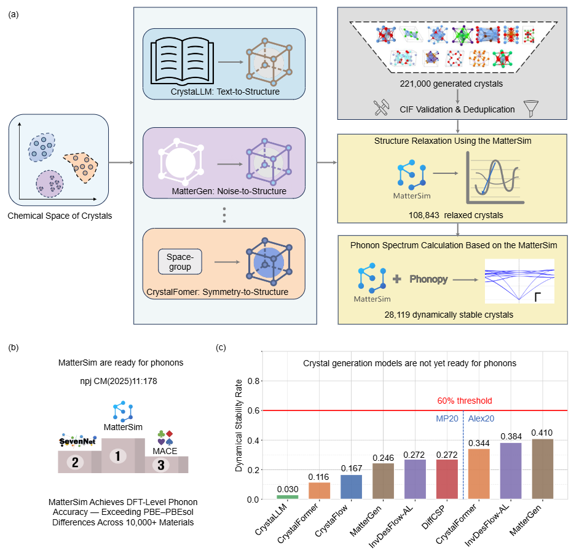

# PhononBench
<p align="center">
  
</p>
PhononBench is a phonon-based benchmark for large-scale dynamical stability evaluation of AI-generated crystals, featuring 100k+ structures, DFT-level MatterSim phonon calculations, and open-source high-throughput workflows.

### Summary of Crystal Generation and Dynamical Stability Statistics

| Model                  | Relaxed | Dynamically Stable | Input Script Success | Unique CIFs | Total Generated |
|------------------------|---------:|-------------------:|---------------------:|------------:|----------------:|
| CrystalFlow-MP20       | 8,533    | 1,428              | 8,852                | 9,952       | 16,000          |
| CrystalFormer-Alex20   | 8,642    | 2,969              | 8,807                | 8,986       | 40,000          |
| CrystalFormer-MP20     | 4,408    | 510                | 4,990                | 5,143       | 20,000          |
| CrystaLLM-MP20         | 1,951    | 58                 | 2,074                | 2,074       | 16,000          |
| DiffCSP-MP20           | 9,163    | 2,488              | 9,959                | 10,000      | 16,000          |
| InvDesFlow-AL-MP20     | 8,000    | 2,176              | –                    | –           | –               |
| InvDesFlow-AL-Alex20   | 22,755   | 8,743              | 24,997               | 25,000      | 30,000          |
| MatterGen-Alex20       | 10,902   | 4,469              | 11,829               | 11,829      | 16,000          |
| MatterGen-MP20         | 9,279    | 2,278              | 10,000               | 10,000      | 16,000          |

> **Note:** The corresponding benchmark data are currently being uploaded and will be made publicly available soon. A download link will be added here once the upload is complete. In the evaluation of crystal generative models, the dynamical stability rate generally converges when phonon calculations are performed for around 4,000 materials. In this study, all tested models—except for the large language model CrystaLLM—exceed this sample size. The specific reasons are discussed in detail in the paper.

## Installation

PhononBench relies on **MatterSim** for DFT-level phonon calculations.
We therefore **strongly recommend installing MatterSim first**, following the official environment setup, before using PhononBench.

### Prerequisites

* **Python ≥ 3.10**
* **mamba or micromamba** (recommended for fast and reliable dependency resolution)
* Linux environment (recommended for large-scale phonon calculations)

We recommend installing MatterSim **from source using mamba**, as this is the most reliable setup for large-scale phonon calculations and was the environment used in this work.

```bash
# clone MatterSim
git clone https://github.com/microsoft/mattersim.git
cd mattersim

# create the environment
mamba env create -f environment.yaml
mamba activate mattersim

# install MatterSim in editable mode
uv pip install -e .
```

## Evaluating Your Own Crystal Generation Model

PhononBench provides a standardized workflow for evaluating the **dynamical stability** of crystal structures generated by custom models.
To evaluate your own crystal generation model, follow the steps below.

---

### Step 1: Generate Crystal Structures

First, use your crystal generation model to generate a **large set of crystal structures** and save them in **CIF format**.
- We recommend generating **at least 10,000 crystal structures** to ensure that,
  after duplicate removal and structure relaxation, **more than 4,000 valid
  structures** remain for reliable dynamical stability evaluation.
- Each structure should be saved as an individual `.cif` file.

Example directory structure:

```
your_model_outputs/
├── structure_00001.cif
├── structure_00002.cif
├── ...
└── structure_10000.cif
```

---

### Step 2: Prepare Phonopy Input Files

Next, use the provided script `batch_prepare_phonopy_input.py` to automatically generate the **Phonopy input files** required for phonon calculations.

Only two arguments need to be specified:

* `--input_dir`: directory containing your generated CIF files
* `--out`: output directory for phonon calculation inputs

The supercell size is controlled by `--dim`.

Example command:

```bash
python batch_prepare_phonopy_input.py \
    --input_dir /home/xqhan/InvDesFlow3.0/Benchmark/MatterGen-gen/dft_band_gap/1.5/gen-cifs \
    --dim 2 2 2 \
    --out /home/xqhan/InvDesFlow3.0/Benchmark/MatterGen-gen/dft_band_gap/bg_1.5/phonon-calculation-input
```

This script will:

* Read all CIF files from `--input_dir`
* Build supercells according to `--dim`
* Generate compressed Phonopy input files (`.yaml.bz2`) for each structure
* Save all generated inputs to the directory specified by `--out`
---


### Step 3: Run Phonon Calculations with Multi-GPU Parallelization

After preparing the Phonopy input files, an additional utility repository is required
to run large-scale phonon calculations.

First, clone the required repository:

```bash
git clone https://github.com/hyllios/utils.git
````

Then, copy the two phonon calculation scripts provided by PhononBench into the
`benchmark_ph` directory of the cloned repository:

* `phonon_multi_gpu_run.py`
* `submit_jobs.sh`

Place both scripts under the following path:

```
utils/benchmark_ph/
```

After completing these steps, you can proceed with the multi-GPU phonon calculations
as described in the next section.

PhononBench provides a multi-GPU parallel execution script (`submit_jobs.sh`) to efficiently perform large-scale phonon calculations using **MatterSim**, depending on the available GPU resources.

Users should modify the script according to their **GPU configuration** and **directory structure**.

---

#### Key Arguments

The following paths must be set according to your local setup:

* `--ref`
  Directory containing the Phonopy input files (`.yaml.bz2`) generated in **Step 2**.

* `--dest`
  Output directory for phonon calculation results.

* `--relaxedDest`
  Directory for saving **relaxed crystal structures** obtained during phonon calculations.

After configuring the paths and GPU settings, make the script executable and run it with:
```bash
chmod +x submit_jobs.sh
bash submit_jobs.sh
```

#### Notes

* The number of GPUs is controlled by `phys_gpus` and `logic_gpus`.
* Each GPU is further divided into multiple sub-jobs via `subparts_per_gpu` to improve utilization.
* The script distributes phonon calculations evenly across GPUs based on `gpu_index` and `subpart_index`.
* Log files are written separately for each GPU and sub-job to facilitate monitoring and debugging.

---


## Citation

If you use **PhononBench** in your research, please cite the following paper:

```bibtex
@misc{han2025phononbenchalargescalephononbasedbenchmark,
  title        = {PhononBench: A Large-Scale Phonon-Based Benchmark for Dynamical Stability in Crystal Generation},
  author       = {Xiao-Qi Han and Ze-Feng Gao and Peng-Jie Guo and Zhong-Yi Lu},
  year         = {2025},
  eprint       = {2512.21227},
  archivePrefix= {arXiv},
  primaryClass = {cond-mat.mtrl-sci},
  url          = {https://arxiv.org/abs/2512.21227}
}
```
